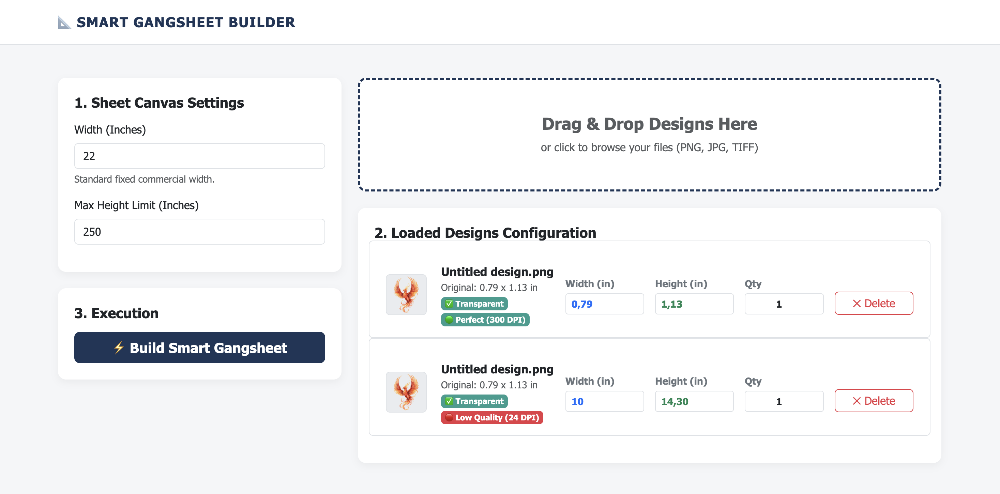
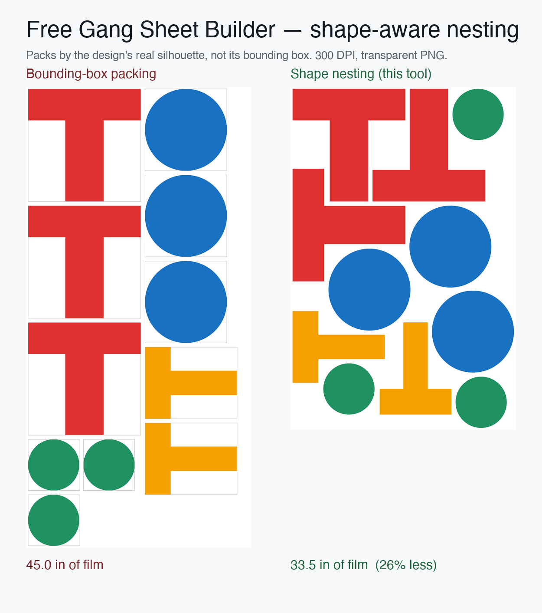

<div align="center">

# 🖨️ GangsheetBuilder

**A free, self-hosted web app that packs print-ready gang sheets — built for real DTF/DTG printing workflows.**

Upload your PNGs, set sizes and quantities, and get tightly-packed, 300 DPI, transparent gang sheets in seconds. No Photoshop, no Illustrator, no monthly SaaS.

[](https://python.org)
[](https://flask.palletsprojects.com)
[](https://pillow.readthedocs.io)
[](https://opencv.org)
[](LICENSE)

<br>



</div>

---

## 🧩 Shape-Aware Nesting — the headline feature

Most gang sheet builders treat every design as a **rectangle**. A round design wastes a whole square of film; two T-shaped prints won't sit side by side even when they obviously could.

GangsheetBuilder packs by each design's **real silhouette** (its alpha shape), not its bounding box — so concave and round designs **interlock**. It will even flip a piece 180° so two Ts nest into each other. On shape-heavy sheets that's routinely **~25–30% less film** for the exact same designs.

<div align="center">



*Same 11 designs. Left: bounding-box packing (45" of film). Right: shape nesting (33.5" — 26% less). Real output from this tool.*

</div>

> 💡 The app actually runs **two** packers — a rectangular [MaxRects](#-how-the-packing-works) packer and the silhouette nester — and automatically keeps whichever layout is shorter. So plain rectangular jobs stay optimal, and irregular jobs get the nesting win.

---

## 🧠 What Is a Gang Sheet?

In DTF (Direct to Film) and DTG (Direct to Garment) printing, a **gang sheet** is a single large print canvas where many designs are packed as tightly as possible to minimize wasted material. Arranging dozens of designs by hand — at precise DPI, in exact dimensions, without overlap — is slow and error-prone. **GangsheetBuilder automates all of it.**

---

## ✨ Features

- 🧩 **Shape-aware silhouette nesting** — packs by the real design shape, interlocking round/T/irregular pieces (see above)
- 🔲 **Rectangular MaxRects packer** — multi-strategy best-of search; the tool keeps whichever layout (rect vs shape) uses less film
- 🔄 **Smart rotation** — tries all four 90° orientations per design when it helps density
- 📏 **Per-design sizing & quantity** — set a target width in inches and how many copies of each design
- 🎯 **0.2" border on every side** — clean, consistent spacing around each design for easy weeding/cutting
- 📄 **Multi-page overflow** — automatically splits across sheets when the max length is exceeded
- 🎨 **CMYK-safe color correction** — converts through CMYK before export so colors print closer to expectation
- 🔍 **Sharpness detection** — flags low-resolution/blurry uploads before you waste film
- 📦 **One-click export** — all sheets in a single ZIP, **300 DPI**, transparent PNG, print-ready
- 🔒 **Self-cleaning & safe** — UUID filenames, directory-traversal protection, startup wipe, and a background GC that deletes files after 30 minutes

---

## 🖥️ How It Works

```
Upload designs (transparent PNG recommended)
        ↓
Server auto-crops to content, measures, scores sharpness
        ↓
You set: target width (inches) + quantity per design
        ↓
Two packers run:
  • MaxRects (bounding-box, best-of search)
  • Silhouette nester (real-shape interlocking, 4 rotations)
        ↓
The shorter (less film) layout wins
        ↓
CMYK color correction → 300 DPI PNG per page → zipped → download
```

---

## 🔬 How the Packing Works

**Rectangular packer (`packing.py`)** — a from-scratch **MaxRects** implementation (free-rectangle model, Best-Short-Side-Fit / Best-Area-Fit / Bottom-Left heuristics). It runs a *best-of* search across sort orders × rotation on/off × heuristic and keeps the tightest result. This replaced the old greedy skyline packer, which used to rotate tall designs so aggressively that two "10.5-wide" prints no longer fit side by side on a 22" sheet.

**Silhouette nester (`nesting.py`)** — packs by real shape:
1. Downsample each design's **alpha channel** to a coarse boolean grid.
2. Dilate by the border amount so every design keeps its 0.2" clearance.
3. For each piece, try all four 90° orientations and find the lowest-then-leftmost collision-free spot via `cv2.matchTemplate` (fast correlation-based collision).
4. Overflow to a new page when the sheet length is exceeded.

Because designs are pasted with their alpha as a mask, interlocking shapes never erase each other's pixels — and because the clearance dilation is larger than one grid cell, coarse-grid rounding can never cause a real overlap.

---

## 🛠️ Tech Stack

| Component | Technology |
|---|---|
| Backend | Python 3, Flask |
| Image processing | Pillow (PIL), OpenCV, NumPy |
| Rectangular packing | Custom MaxRects (best-of search) |
| Shape nesting | Alpha-mask grid + `cv2.matchTemplate` collision |
| Frontend | HTML, CSS, JavaScript (drag-and-drop) |
| Output | PNG (300 DPI, RGBA) → ZIP |

---

## ⚙️ Getting Started

### Prerequisites
- Python 3.8+
- pip

### Installation

```bash
# Clone the repository
git clone https://github.com/Brkberber/GangsheetBuilder.git
cd GangsheetBuilder

# Install dependencies
pip install -r requirements.txt

# Run the server
python main.py
```

Then open **http://localhost:5006** in your browser.

### Requirements

```
flask
pillow
opencv-python
numpy
```

---

## 📁 Project Structure

```
GangsheetBuilder/
├── main.py          # Flask app + routes; runs both packers, renders output
├── packing.py       # Rectangular MaxRects packer (best-of search)
├── nesting.py       # Shape-aware silhouette nester
├── image_utils.py   # Upload processing, cropping, sharpness, CMYK correction
├── cleanup.py       # Startup wipe + background garbage collector
├── config.py        # DPI, border, sheet defaults, cleanup timings
├── requirements.txt
├── assets/
│   ├── screenshot.png
│   └── packing-comparison.png
└── templates/
    └── index.html   # Drag-and-drop UI
```

---

## 🔧 Configuration

Defaults live in `config.py`; sheet width and max length are also set per-request from the UI.

| Parameter | Default | Description |
|---|---|---|
| Sheet width | 22 inches | Standard DTF roll width |
| Max sheet height | 250 inches | Maximum gang sheet length |
| Border (padding) | **0.2 inches** | Clearance on every side of each design |
| DPI | 300 | Output resolution |
| File expiry | 30 minutes | Auto-cleanup age threshold |

---

## 🚀 API Reference

| Endpoint | Method | Description |
|---|---|---|
| `GET /` | GET | Main UI — also flushes uploads/output on load |
| `POST /upload-files` | POST | Upload and process image files |
| `POST /delete-file` | POST | Delete a single uploaded file from disk |
| `POST /generate-gangsheet` | POST | Run both packers and generate output |
| `GET /download/<filename>` | GET | Download the generated ZIP |

---

## 🗺️ Roadmap

- [ ] Docker image for one-command deployment
- [ ] Per-design "no rotation" lock (for orientation-sensitive prints)
- [ ] Adjustable border/margin from the UI
- [ ] JPG and other input formats
- [ ] Custom DPI selection
- [ ] True no-fit-polygon nesting for even tighter irregular packing

Have an idea? Open an issue or PR — contributions welcome.

---

## 👨‍💻 Developer

Built by **Burak Berber** — Civil Engineering student at Boğaziçi University, self-taught developer.
Developed and used in a real production printing workflow.

[](https://www.linkedin.com/in/brk-berber)
[](https://github.com/Brkberber)

---

## 📄 License

[MIT](LICENSE) — free to use, modify, and self-host.

## ⚠️ Disclaimer

Provided as-is for generating print layouts. Always double-check color accuracy and dimensions against your specific printer/film before running a full production batch.
